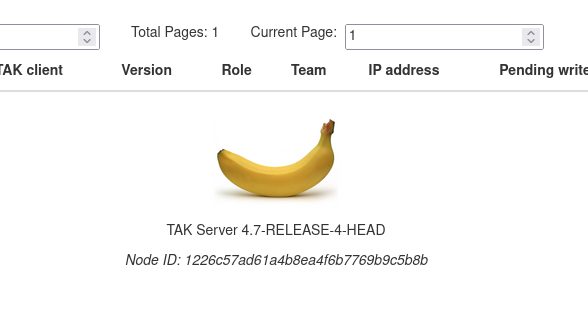

# FREQUENTLY ASKED QUESTIONS

## docker-compose not found?
If you have definitely installed Docker, try "docker compose" (with a space). This pointless modification broke scripts around the world but it's only Docker right!
We have fixed this in the latest script to handle both.

## Where are the docs?

You can find the PDF manual in the tak/docs folder and get help from *community volunteers* via the TAK Discord server. If you ask a bone FAQ already covered in the manual, or demand urgent assistance, expect to get some grief. **RTFM and be patient**.

## How do I start over?
```
sudo ./scripts/cleanup.sh
```

This script will stop the TAK Server container, remove the mapped database volume and remove the folder "tak" which is created in the project root directory (cloned from github) during the setup process. 

WARNING: If you have data in an existing TAK database container it will be lost.

## How do I make a new certificate for my EUDs?
Enter the docker container and run the makeCert.sh script as follows.

    docker exec -it tak-server-tak-1 bash
    cd /opt/tak/certs
    /makeCert.sh client EUD1
    exit

You can collect your EUD1.p12 file from ./tak/certs/files/

## Why does my EUD not connect?
Ensure you have created EUD certificates and have configured the following properly on your ATAK server settings:
    
- Address: Can you reach this with a browser on Android? If not - fix your network.
- Protocol: SSL
- Server Port: 8089
- Uncheck "Use default SSL/TLS Certificates"
- Import truststore-root.p12 to "Import Trust Store" with password atakatak
- Import {user}.p12 to "Import Client Certificate" with the name you chose during setup and the same password

On the server check:

- You have added a user eg. EUD1 https://takserver:8443/user-management/index.html#!/
- You have created a certificate for this user with the same name/callsign so EUD1 needs a matching file within ./tak/certs/files called EUD1.p12

## How do I enable Certificate Enrollment?

Visit https://localhost:8443/Marti/security/index.html#!/modifySecConfig and click Edit.
Enable "Enable Certificate Enrollment" and then Submit.

## I can't import the certificate to my browser?
Ensure the admin.p12 file is owned by you. Use the atakatak password when prompted and ensure you enable the TAK authority to "authenticate websites" in Firefox.

## How can I change the logo at the footer of the web page

The logo can be changed **without** stopping or setting up the TAK Server again.



The script takes one command line argument which is the full path to the **PNG** or **JPG** image of new logo. Sudo permission may not be needed depending on your docker permissions.

```
chmod +x scripts/logo-replacement.sh
sudo ./scripts/logo-replacement.sh /home/eric/banana.jpg
````

The script will check for all dependencies required, and if not present, the script will attempt to install them for you. The dependencies needed are __*openJDK*__ (JAVA environment is required to be able to repack the jar correctly) and ImageMagick for conversion.

## How can I upload a data package to Marti sync?
This is uber-secret.
A successful POST will return a JSON message containing a SHA256 hash. This hash is the unique filename on the server

### Upload

    curl 'https://127.0.0.1:8443/Marti/sync/upload' \
    --cert ssl/user.pem:atakatak \
    --key ssl/user.key \
    --cacert ssl/ca.pem \
    -F assetfile=@BIGPLAN.MK2.zip \
    -F Name=BIGPLAN.MK2 \
    -k -v

### Download

    https://takserver:8443/Marti/sync/content?hash=a10f4b65b27fd9ce047bf7c94f5841a503d1910d76cd156f749c4ff69e90ac33

## How do I renabled TCP on port 8087

Edit docker-compose.yml and add port mappings for "8087:8087" around line 28.
Rebuild.

    docker-compose build

# Known issues

  ## Loads of repeat java exceptions eg java.lang.RuntimeException...
One or two is expected behaviour due to the time the backend processes take to start up. If you get lots or it's still ongoing after 2 minutes, run the cleanup script as sudo to prune stale images.

  ## Failed to initialize pool: Connection to tak-database:5432 refused
This indicates a docker network issue. Run the clean up script as sudo to prune stale networks.

 ## The login screen doesn't take my password?
 Just wait a minute or two. This is expected behaviour due to the time the backend processes take to start up.

 ## Running the /setup wizard breaks the database?
 This script **is the wizard** so it gets you past the setup wizard (Section 4.4 in the configuration guide) and populates the database tables. Only run the wizard if you know what you're doing as **this will break your database connection** - at which point you should set this up the hard way.

## ERROR: could not find an available, non-overlapping IPv4 address pool among the defaults to assign to the network
Stop your vpn, prune your networks
```
service openvpn stop
docker network prune
```
## My custom logo doesn't show up?
If the script ran as sudo and completed ok, refresh your browser's cache with Ctrl-F5