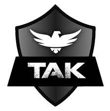
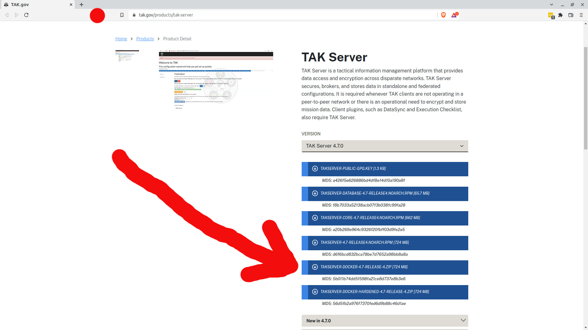

# TAK SERVER



This is a docker wrapper for an official 'OG' TAK server from [TAK Product Center](https://tak.gov/) intended for beginners. It will give you a turnkey TAK server with SSL which works with ATAK, iTAK, WinTAK.

The key improvements are:
 - Automatic configuration 
 - Certificate generation
 - Secure password generation
 - Updates postgres10 to postgres14
 - Updates debian 8 to debian 11

 ## Known issues
 ### The login screen doesn't take my password?
 Just wait a minute....or two. Apparently this is normal!

## Download the official TAK release
Before you can build this, you must download a TAKSERVER-DOCKER-X.X-RELEASE 

Releases are now public at https://tak.gov/products/tak-server

Please follow account registration process, and once completed go to the link above. 
The integrity of the release will be checked at setup against the MD5/SHA1 checksums in this repo. These must match. If they do not match, DO NOT proceed unless you trust the release. 



## TAK server release checksums

| Release filename                             | Bytes | MD5 | SHA1 |
| ----------------------------------- | -- | -- | -- |
| takserver-docker-4.6-RELEASE-26.zip |  462381384 | dc63cb315f950025707dbccf05bdf183 | 7ca58221b8d35d40df906144c5834e6d9fa85b47 |
| takserver-docker-4.7-RELEASE-4.zip | 759385093 | 5b011b74dd5f598fa21ce8d737e8b3e6 | b688359659a05204202c21458132a64ec1ba0184 |


## Requirements
- Docker
- A TAK server release
- 4GB memory
- Network connection 

## Installation
Fetch the git repo and cd into the directory

    git clone https://github.com/Cloud-RF/tak-server.git
    cd tak-server

### Docker security

These scripts assume you don't need to sudo for `docker` and `docker-compose`.
Run as root if needed, however please have in mind that the container might be set up as _privileged container_, and for security reasons we do not recommend that.
See https://docs.docker.com/engine/install/linux-postinstall/ for details.

You can also chown the docker.sock file which isn't as recommended, but works.

    sudo chown $USER /var/run/docker.sock

### x86, AMD64 & ARM64 (Pi4) setup 
The script will auto-detect your architecture and use the arm docker file if arch == arm64

```
cd tak-server
chmod +x scripts/setup.sh
./scripts/setup.sh
```

The setup.sh script will populate config files, start up TAK server with a POSTGRES database via docker-compose and generate the required certificates.There will be prompts and some input required from the user such as certificate names. At the end of the setup the user will be given random passwords and a link to access the web interface where further settings can be applied.

For more information on using TAK server refer to [the docs on the TPC Github](https://github.com/TAK-Product-Center/Server/tree/main/src/docs).

### Network ports
TAK server needs the following port numbers to operate. Services already using these will cause a problem which the script will detect and offer a resolution for. If you're running as sudo it can kill the processes.

    8443, 8444, 8446, 8087, 8088, 9000, 9001, 8080

If you are going to expose these ports be careful. Not all of them run secure protocols. For piece of mind, and for working through firewalls and NAT routers run this on a VPN like OpenVPN or NordVPN. 

## Passwords
The openjdk-11 setup **will take several minutes**. Please be patient and ignore any repeat Java exceptions whilst the network components start up and try to find each which is expected behaviour. When it's done you will be shown random passwords which you will need to login. *You can change these later from the admin interface.*


## Admin login
Use your new admin login to access the interface in a web browser at:

    http://localhost:8080

If it hangs, reload the page after a minute and expect a big scary legal warning about US Gov export controls on a piece of open source software. Be confused for a second and then click ok...


### Logging
You can access a shell in the running docker container with this command:

    docker exec -it tak-server_tak_1 /bin/bash

To tail the server log from inside the container:

    tail -f /opt/tak/logs/takserver.log

### Changing the logo at the footer of the web page

The logo can be changed **without** stopping or setting up the TAK Server again.

This option has been added as stand alone script __*"logo-replacement.sh"*__ which is located in main folder.

The script takes one command line argument which is the full path to the **PNG** or **JPG** image of new logo. Before executing please make sure the script is executable as in an example below:

```bash
chmod +x logo-replacement.sh

./logo-replacement.sh <full path to new logo image>
````

The script will check for all dependencies required, and if not present, the script will attempt to install them for you. The dependencies needed are __*openJDK*__ (JAVA environment is required to be able to use the *jar* command) and __*ImageMagick*__

Once dependencies are satisfied, the process of changing the logo takes place. The new logo size is 200x100 pixels. However, the size is not required for successful change, so feel free to change these numbers in the script to your preferences.

### Clean up
```
./scripts/cleanup.sh
```

This script will stop the TAK Server container, remove the mapped volumes and remove the folder "tak" which is created in the project root directory (cloned from github) during the setup process. 

## Contributing
Please feel free to open merge requests. A beginner's guide to github.com is here:

 https://www.freecodecamp.org/news/how-to-make-your-first-pull-request-on-github-3/

## Authors and acknowledgment
Thanks to the TAK product center for open-sourcing and maintaining all things TAK. 

Thanks to James Wu 'wubar' on gitlab/Discord for publishing the docker wrapper on which this was built.

Thanks to protectionist dinosaurs, on both sides of the pond, who are threatened by TAK's open source model for the motivation :p

## Useful links

[TAK server on TAK.gov](https://tak.gov/products/tak-server)

[ATAK-CIV on Google Play](https://play.google.com/store/apps/details?id=com.atakmap.app.civ&hl=en_GB&gl=US)

[iTak on Apple App store](https://apps.apple.com/my/app/itak/id1561656396)

[WinTAK-CIV on TAK.gov](https://tak.gov/products/wintak-civ)

